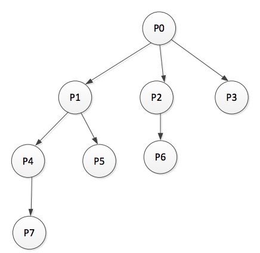

# LOG710
## Cours 1
### Système d'exploitation
Un logiciel qui agit comme intermédiaire entre l'utilisateur et le matériel d'un ordinateur.
### Objectifs d'un OS
1. Fournir un environnement d'exécution pour les programmes.
2. Rendre un système plus facile à utiliser.
3. Utiliser le matériel de l'ordinateur plus efficacement.
### Mécanisme des interruptions
* L'OS est responsable de la gestion du matériel composant le système informatique.
* Le CPU doit communiquer avec des périphériques externes.
    * asynchrones (ayant des cycles d'horloges différents)
    * beacoup moins rapide
* Comment le CPU peut être capable de traiter les évènements générés par les périphériques externes et répondre
rapidement?
* Comment le CPU peut faire du travail utile en attendant ces évènement?
#### Scrutement (polling)
|Fonctionnement|Avantage|Inconvénients|
|---|---|---|
|Aller vérifier l'état des périphériques (s'ils ont des requêtes?, terminé?) de temps en temps| Simple | 1. Prends du temps de la CPU même s'il n'y a pas de requêtes |
| | |2. Quand faire le polling? Difficile à prédire.|
#### Interruption
|Fonctionnement|
|---|
|Chaque périphérique peut envoyer un signal à la CPU pour indiquer un évènement (requête)|
|Pas de coûts d'interrogation des périphériques lorsqu'il n'y a pas de requêtes|
|Réponse plus rapide|
## Cours 2
### Exercice
#### Exercice 01
On considère le code Listing 1. Y compris le processus parent initial, déterminer le nombre de processus qui sont créés
par le programme.
```c
#include <stdio.h>
#include <unistd.h>
int main() {
    // fork a child process
    fork();
    fork();
    fork();
    return -;
}   // Listing 1
```
##### Réponse
8 processus
#### Excercice 02
On considère le programme Listing 2. Quelle est la sortie du programme au niveau des lignes A, B, C et D. On suppose que
le pid du processus parent est 2600 et celui du fils est 2603.
```c
#include <sys/types.h>
#include <stdio.h>
#include <unistd.h>
int main() {
    pid_t pid, pid1;

    // fork a child process
    pid = fork();

    if(pid < 0){
        fprintf(stderr, "Fork failed");
        return 1;
    }
    else if (pid == 0){
        pid1 = getpid();
        printf("pid = %d", pid); // A
        printf("pid1 = %d", pid1); // B
    }
    else{
        pid1 = getpid();
        printf("pid = %d", pid); // C
        printf("pid1 = %d", pid1); // D
        wait(NULL);
    }
    return 0;
}   // Listing 2
```
##### Réponse
Ligne  A  --> 0
Ligne  B  --> 2603
Ligne  C  --> 2603
Ligne  D  --> 2600
#### Exercice 03
On considère le programme Listing 3. Expliquer la sortie au niveau de la ligne A.
```c
#include <sys/types.h>
#include <stdio.h>
#include <unistd.h>

int value = 5;

int main() {
    pid_t pid, pid1;

    // fork a child process
    pid = fork();

    if (pid == 0){
        value += 15;
        return 0;
    }
    else if(pid > 0){
        wait(NULL);
        printf("value = %d", value); // A
        return 0
    }
}   // Listing 2
```
##### Réponse
À la ligne A,, la variable value est toujours égale à 5 (le processus fils a sa propre copie de la variable value donc
l'incrémentation value += 15 se fait sur la copie du fils et n'a aucun effet sur celle du processus père)

#### Exercice 04
On considère l'instruction suivante:
```c
for(int i=0; i<3; i++)
    fork();
```
On suppose que l'appel système `fork()` ne retourne pas d'erreurs.
a) Quel est le nombre de processus créés par l'instruction suivante?
b) Donnez l'arborescence des processus.
##### Réponse
a) 08 processus

b)



#### Exercice 05
Que fait le programme suivant:
```c
int main()
{
    int p=1;
    while(p>0)
        p=fork();
    execlp("prog", "prog", NULL);
    return 0;
}
```
##### Réponse
Avec ce programme, le processus initial (celui qui exécute main), crée continuellement des processus fils jusqu'à ce que
le système refuse de créer plus aucun autre processus (épuisement de ressource). Chacun des processus créés charge l'
image binaire d'un programme `prog` et l'exécute.

#### Exercice 06
On veut faire une recherche d'un élément dans un tableau d'entiers. Écrire un code ou le processus principal crée 4 processus fils qui chacun fait la recherche dans une partie du tableau. Chacun de ses processus fils exécute une fonction trouve (int element, int partie). Cette fonction retourne en cas de succès et 0 sinon. Un processus fils retourne le résultat de la recherche en utilisant l'appel système exit comme suit: `exit(0)` en cas de succès et `exit(1)` en cas d'échec. Quand le processus père est notifié du succès d'un processus fils, il tue tous les autres processus en faisant l'appel système `kill(pid, SIGKILL);`.
##### Réponse
```c
#include <sys/types.h>
#include <sys/wait.h>

int tab[12] = {12,7,0,4,7,21,3,100,103,99,54,17};

int trouve(int a, int partie){
  int j;

  for(j=partie*3; j < (partie+1)*3; j++)
    if(tab[j]==a){
      return 1;
    }

  return 0;
}

int main(){

	int pid[4], status, x, i;

	for(i = 0; i<4; i++)
	{
	  if((pid[i]=fork()) == 0){
		printf("Processus fils no %d cree : %d\n",i,getpid());
		if(trouve(4,i))
		  exit(0);
		else exit(1);
	  }
	}

	while((x=wait(&status))>0)
	   if(!WEXITSTATUS(status))
	   {
		 printf("Processus %d found it\n",x);
		 for(i=0;i<4;i++)
			if(pid[i]!=x) kill(pid[i],SIGKILL);
		  exit(0);
	   }
	exit(1);
}
```
#### Exercice 07
Écrivez un code ou le processus principal lance, l'un à la suite de l'autre, les fichiers exécutables passés en paramètres. Un fichier exécutable est lancé seulement quand tous ceux qui le précèdent sont terminés. Avant de se terminer, le processus principal affiche le nombre de lancement de fichiers exécutables qui ont échoués (parce que le fichier n'existe pas ou n'est pas exécutable).
##### Réponse
```c
#include<string.h>
#include<sys/types.h>
#include<sys/wait.h>
#include<stdlib.h>
#include<unistd.h>

int main(int argc, char* argv[])
{
  char* fich[argc-1];
  int status, i, j = 0;
  for(i=1;i<=argc;i++){
    if(fork()==0){
     execlp(argv[i],argv[i],NULL);
     exit(3);
    }

    wait(&status);
    if(WEXITSTATUS(status)==3)
    {
      fich[j]= (char*)malloc(strlen(argv[i])+1);
      strcpy(fich[j],argv[i]);
      j++;
    }
  }
  printf("Nombre de programmes noexecutes: %d\n",j);
  if(j!=0){
     printf("Liste des programmes non executes:\n");
     for(i=0;i<j;i++)
        printf("%s\n",fich[i]);
   }
  return 0;
}
```
#### Exercice 08
Écrire le code ou vous utiliser PThreads pour exprimer la concurrence. Ce programme permet de chercher le minimum dans un tableau d'entiers.
##### Réponse
```c
#include <pthread.h>
#include <limits.h>
#define MAX_THREADS	512
#define N_THREADS	10

void *find_min(void *list_ptr);


int min, partition_size = 2;
int list[N_THREADS*5] = {5, 2, 10, 6, 3, 9, 4, 23, 5, 6, 7, 2, 10, 17, 6, 4, 14, 72, 8, 9};

 main() {

  min = INT_MAX;
pthread_t p_threads[MAX_THREADS];
pthread_attr_t  attr;
int i;

  pthread_attr_init(&attr);
  pthread_attr_setdetachstate(&attr, PTHREAD_CREATE_JOINABLE);

for (i=0; i< N_THREADS; i++)
   pthread_create(&p_threads[i], &attr, find_min, (void *) &list[i*partition_size]);


for (i=0; i< N_THREADS; i++)
    pthread_join(p_threads[i], NULL);

printf("Minimum : %d\n", min);
 }

void *find_min(void *list_ptr) {

  int *local_ptr, i;

    local_ptr = (int*) list_ptr;

  for (i = 0; i < partition_size; i++)
        if (local_ptr[i] < min){

            min = local_ptr[i];
         }

 pthread_exit(0);
}
```

## Cours 3
### Exercice
#### Exercice 01
Le signal `SIGCHILD` est automatiquement envoyé par un processus fils à un processus père lorsque le fils se termine (par un exit, un return ou autre). Compléter le code suivant en écrivant un gestionnaire de signal adéquat pour que le père n'attende jamais son fils de façon bloquante et que le fils ne devienne pas zombie.
```c
/* 0 */
int main(int argc, char *argv[])
{
  /* 1 */
  if(!fork())
  {
    /* 2 */
    for(int i=0; i<10; i++) // simule un petit calcul
    /* 3 */
    exit(1);
    /* 4 */
  }
  /* 5 */
  while(1) // simule un calcul infini
  /* 6 */
}
```
##### Réponse
```c
/* 0 */
void handler(int sig){
	if (sig == SIGCHLD) {
	   wait(NULL);
	   if (!(pid2=fork()))
	   	{ printf("Je suis le processu fils 2. Mon pid est %d\n", getpid());
	   		exit(1) ; /*4*/
	    }
	}
}
int main(int argc, char *argv[])
{
  /*1*/
	signal(SIGCHLD, handler);
	if (!fork())
	{
    printf("Je suis le processus fils 1. Mon pid est : %d\n",getpid());
    /*2*/
		for (int i = 0 ; i <10 ; i++) ;
		//simule un certain calcul
    /*3*/
		exit(1) ;
    /*4*/
	}
	/*5*/
	waitpid(pid2, NULL);
	while(1) ; //Simule un calcul infini
  /*6*/
}
```
#### Exercice 02
On considère le code suivant:
```c
#include <unistd.h>
#include <sys/types.h>
#include <sys/wait.h>
#include <stdio.h>
#include <signal.h>
#define N 5
/* 0 */
int main()
{
  pid_t pid[N];
  int i;
  /* 1 */
  for(i=0; i<N; i++)
  {
    if((pid[i]=fork()) == 0)
    {
      /* 2 */
      while(1)
      {
        printf("ici fils %d", i);
        /* 2 */
      }
    }
    /* 3 */
  }
}
```
Compléter ce code pour implémenter le comportement suivant: Un processus père utilise les signaux `SIGSTOP` et `SIGCONT` pour suspendre(bloquer) et reprendre (débloquer) l'exécution de ses processus fils. Initialement, tous les processus fils crées doivent se mettre en pause. Le processus père répète continuellement le traitement suivant en commençant par le premier fils : il envoie le signal `SIGCONT` au fils suivant (le fils suivant du dernier est le premier). Lorsqu'un processus fils reçoit le signal `SIGCONT`, il affiche le message indiquant qu'il a capturé le signal `SIGCONT` avant de poursuivre son exécution. Les processus fils doivent utiliser les appels systèmes `pause()` ou `sleep(v)` pour attendre un signal de la part du processus père.
##### Réponse
```c
#include <unistd.h>
#include <sys/types.h>
#include <sys/wait.h>
#include<stdio.h>
#include <signal.h>
#define N 5
/*0*/
void action(int signum) {
	printf("capture de SIGCONT %d\n", getpid());
}
int main( )
{ pid_t pid[N];
  int i ;
  /*1*/ signal(SIGCONT,action);
  for ( i=0; i<N;i++)
   if ((pid[i]=fork())==0)
    { /*2*/pause() ;
      while(1) {
        printf("ici fils %d de pid %d \n", i, getpid());
        pause(); //sleep(1);
      }
    }
  /*3*/
  while (1)
    for(i=0; i<N;i++)
      { kill(pid[i], SIGCONT); sleep(1); kill(pid[i], SIGSTOP); }
}
```
#### Exercice 03
On considère `N` processus qui communiquent au moyen de tubes de communication anonymes (temporaires) (unnamed pipe). Chaque processus partage 2 tubes: un avec le processus de droite et un autre avec le processus de gauche. La figure suivante montre l'architecture de communication pour le cas de N=4 processus.

Écrire un code qui implémente cette architecture de communication des `N` processus créés. Le processus initial qui résulte de l'exécution de main crée les `N` processus (N=4). L'entrée standard et la sortie standard de chaque processus `Pi` sont redirigées vers les tubes voisins correspondants. L'entrée et la sortie standards du processus `P0` deviennent respectivement la sortie et l'entrée des tubes `tub3` et `tub0`. On suppose que chaque processus exécute comme traitement une fonction `proc(i)` avec `i` le numéro du processus. Vous n'avez pas à écrire le code de `proc`.
##### Réponse
```c
#include <unistd.h>
#include <sys/types.h>
#include <sys/wait.h>
#include <stdio.h>
#include <stdlib.h>
#define N 4
#define BUFFER_SIZE 100

char msg[BUFFER_SIZE];

void proc( int );

int main ()
{
	int i,j ;

	int fd[N][2];

	for(i=0; i<N; i++){
		pipe(fd[i]);
	}

	for(i=0; i<N; i++){
		if (fork() == 0)
		{
			dup2(fd[i][1],1);
			dup2(fd[(N+i-1)%N][0],0);  //dup2(fd[(N+i-1)%N][0],0);
			for(j=0 ; j < N; j++)
			{
				close(fd[j][0]);
				close(fd[j][1]);
			}
			sleep(i);
			proc(i);
			exit(0);
		}
	}
	exit(0);
}
// Code de la function proc
void proc(int x)
{
	// printf("Je suis le procesus P%d \n", getpid());

	if (x==0){
		//write(1,"Hello this me!", 15);
		printf("Hello_this_me!\n");
	}
	else if (x!=3) {
		scanf("%s", msg);
		printf("%s", msg);
	}
	else {
		scanf("%s", msg);
		fprintf(stderr,"%s\n", msg);
		fflush(stderr);
	}
	fflush(stdout);
}
```
## Cours 4
